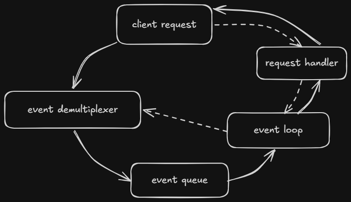

### Reactor Pattern in Nodejs
The reactor pattern is an architectural pattern designed to handle many I/O operations simultaneously.
Instead of creating a thread for each request and waiting for the response, the reactor solves this by using a mechanism that observes multiple I/O sources (event demultiplexer), which is notified when the result from some of these sources is ready, and sends it to the event queue for the event loop to process.

