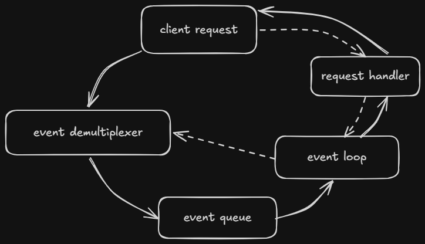

## Reactor Pattern in Nodejs
The reactor pattern is an architectural pattern designed to handle many I/O operations simultaneously.
Instead of spawning threads for each operation, a central loop continuously listens for incoming events, determines which handlers should process them, and dispatches execution accordingly.

At a high level, the event loop acts as:
- demultiplexer: deciding which events are ready
- scheduler: prioritizing different types of tasks
- dispatcher: executing the appropriate handlers

Call stack represents the execution context of the program. Every function invocation is pushed onto the stack and removed once execution completes. The event loop cannot schedule or execute asynchronous work until the call stack is completely empty.

This structure enforces a strictly synchronous and sequential execution model:
- Only one operation executes at a time
- Each operation must complete before the next begins
- Long-running tasks block all progress

Event loop is responsible for orchestrating all execution outside the synchronous call stack. It continuously checks whether the system is ready to process more work and decides what should run next. Rather than treating all asynchronous tasks equally, the event loop introduces priority-based scheduling through distinct queues.

The loop operates in cycles, and in each cycle it:
- Waits for the call stack to become empty
- Processes high-priority tasks (microtasks)
- Processes one lower-priority task (macrotask)
- Repeats indefinitely

In Reactor Pattern we have multiple task queues with different priorities, so we have high-priority and lower-priority operations.

### Microtask Queue:
Represent high-priority, short-lived operations that must execute as soon as possible after the current synchronous work completes. The event loop will fully drain the microtask queue before moving on to any other type of work.

### Macrotask Queue:
Represent coarser-grained, lower-priority operations, typically originating from outside the immediate execution context. Unlike microtasks, macrotasks are processed one per event loop iteration.

