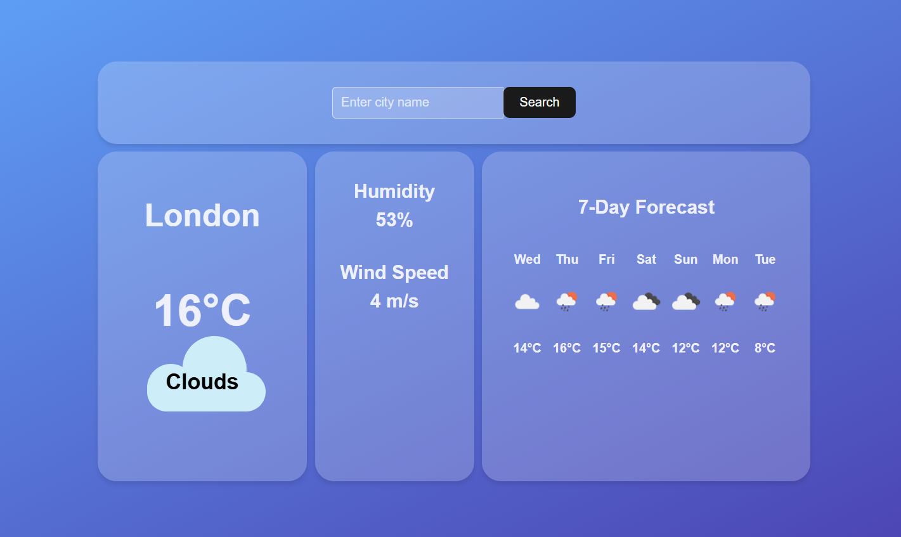

# POC | Weather App in React.js



> Fully functional weather app that shows the weather for any city and a 7-day weather forecast for the city, using Open Weather API

## 🚀 Installing and running the project

To install and run the project locally, follow these steps:

```
npm install
npm run dev
```

The project will be running at `http://localhost:5173/`

## 📝 Copyrights
The project uses the following animations from codepen.io:

- [Authentic Weather Loader](https://codepen.io/tholman/pen/AvWXMr) by Tim Holman

- [Weather-icon](https://codepen.io/miaamen/pen/mdyQxPy) by Mia


